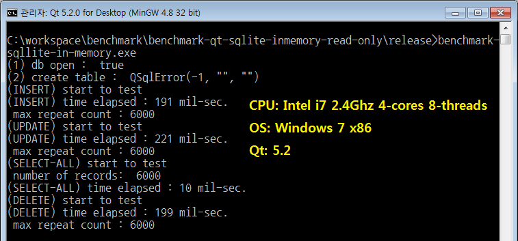
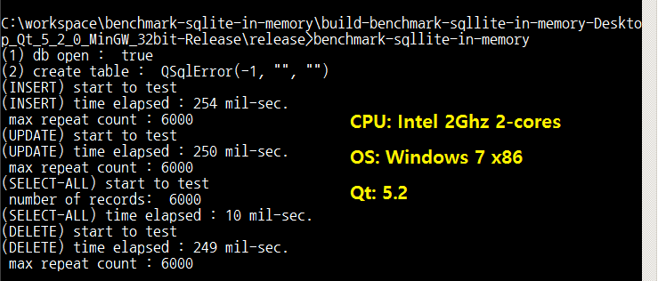
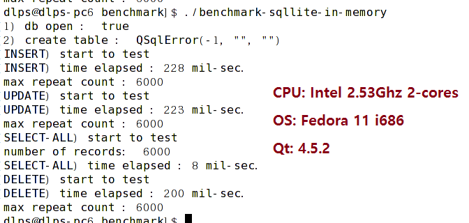

**Benchmark Test Environment: Qt(4 or 5) + Sqlite with In-memory**

**How to test**

**Test Case: 6000 records is repeated. **

**  CREATE TABLE qdn( id int primary key, name varchar(50) )\
 **

INSERT INTO qdn VALUES( :id, :name )\
 

UPDATE qdn SET name='newhello' WHERE id = :id\
 

SELECT \* FROM qdn\
 

DELETE FROM qdn WHERE id = :id\
 

**Result 1**

**Result 2**

**Result 3**

